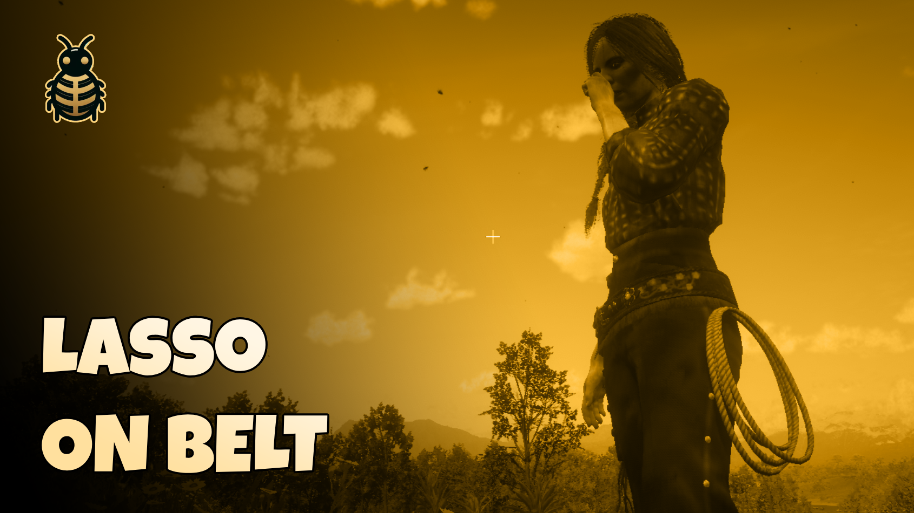

# 🎯 RedM Lasso on Belt

Realistically display your lasso on your character's belt when equiped from inventory but not in use!.

## ⚠️ Note
I made a more advanced script for belt attachments which comes with synced attachements feature between all players, unlike this one. More Info: https://github.com/blnStudio/bln_belt_attachments 

## Features
- Automatically shows/hides lasso on your belt.
- Smooth transitions when equipping/unequipping
- Works with both male & female characters
- Fully adjustable positioning
- Supports both regular and reinforced lassos.

## Installation
1. Download the `bln_belt_lasso` script
2. Place it in your server's `resources` folder
3. Add `ensure bln_belt_lasso` to your `server.cfg`

## 🛠️ Usage
The script works automatically once installed. When you have a lasso in your inventory:
- Lasso appears on your belt when equipped.
- Automatically hide/show lassow when use.

## Support 💬
Need help? Join our Discord server:
[Join Discord](https://discord.com/invite/MEZRYQVpnt)

## Credits 🙏
Created by [BLN Studio](https://bln.tebex.io)
Feel free to contribute to this project! 
